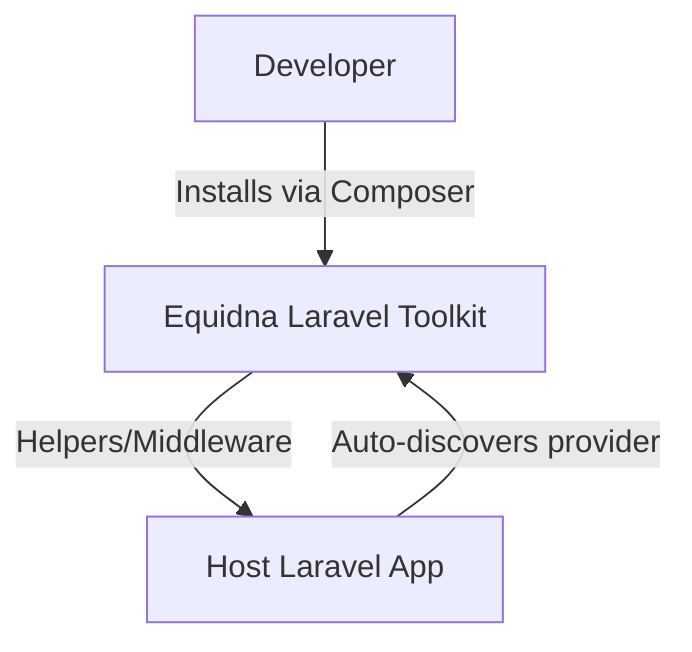
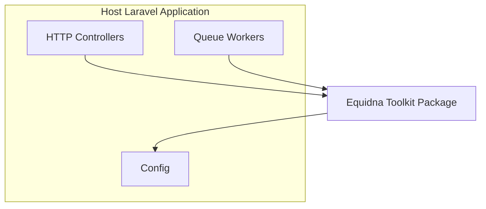
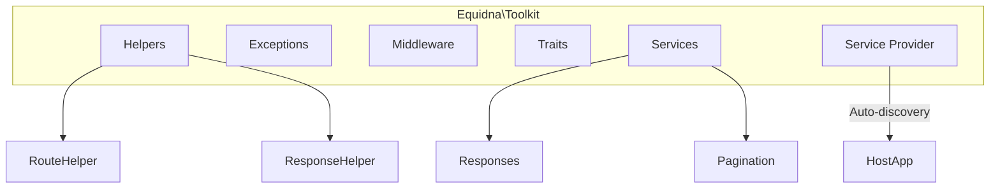

# Architecture Diagrams

## System Context Diagram

```mermaid
flowchart TD
  Dev[Developer] -->|Installs via Composer| Package[Equidna Laravel Toolkit]
  Host[Host Laravel App] -->|Auto-discovers provider| Package
  Package -->|Helpers/Middleware| Host
```

## Container Diagram

```mermaid
flowchart TD
  subgraph HostApp[Host Laravel Application]
    Web[HTTP Controllers]
    Jobs[Queue Workers]
    Config[Config]
  end
  Package[Equidna Toolkit Package]
  Web --> Package
  Jobs --> Package
  Package --> Config
```

## Component Diagram

```mermaid
flowchart TD
  subgraph Package[Equidna\Toolkit]
    Helpers[Helpers]
    Exceptions[Exceptions]
    Middleware[Middleware]
    Traits[Traits]
    Services[Services]
    Providers[Service Provider]
  end
  Helpers --> RouteHelper
  Helpers --> ResponseHelper
  Services --> Responses
  Services --> Pagination
  Providers -->|Auto-discovery| HostApp
```
